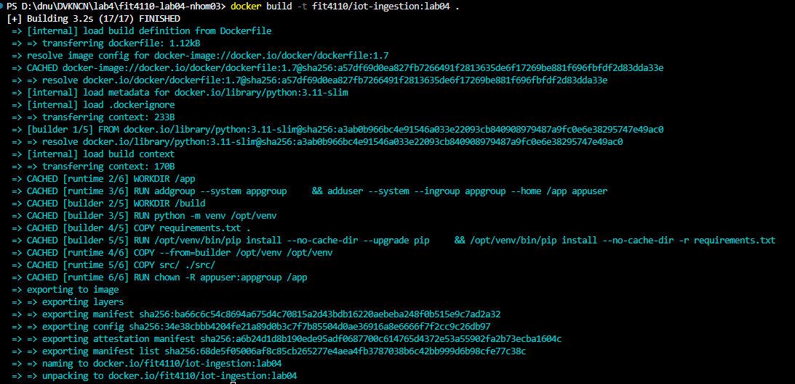
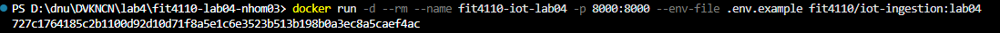
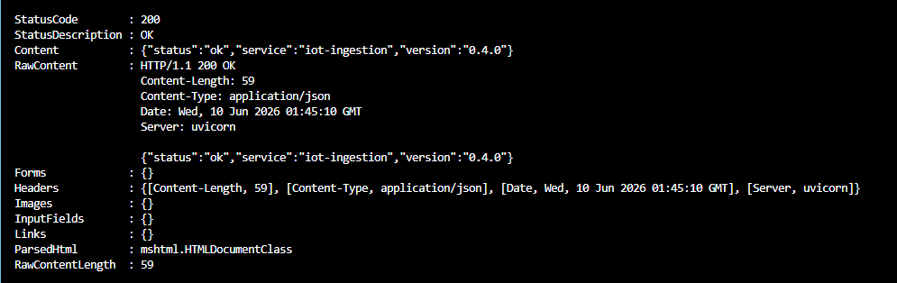

# Submission Checklist – Lab 04

Nộp các minh chứng sau:

- [x] `Dockerfile`
- [x] `.dockerignore`
- [x] `.env.example`
- [x] `RUN_LOCAL.md`
- [x] Contract OpenAPI đã xùng
- [x] Postman Collection đã chạy trên container
- [x] Postman Environment local/docker
- [x] Newman report XML/HTML
- [x] Log hoặc ảnh `docker build` 
- [x] Log hoặc ảnh `docker run` !
- [x] Log hoặc ảnh `GET /health`
- [x] Link hoặc tên image tag đã push: fit4110/iot-ingestion:lab04 ghcr.io/nhom03/team-iot:v0.1.0-team-iot